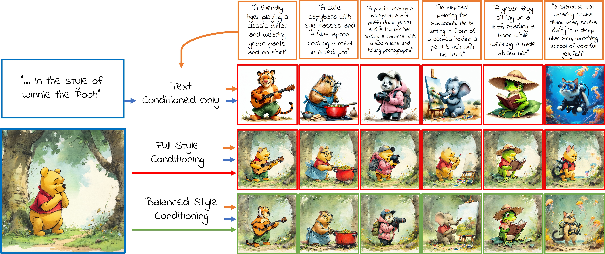

<h1 align="center">
  [CVPR 25] Conditional Balance:  <br>
  Improving Multi-Conditioning Trade-Offs in Image Generation <br>
  SD3.5 Inference Code
</h1>

<p align='center'>
<a href="https://nadavc220.github.io/conditional-balance.github.io/"></a>
<a href="https://www.youtube.com/watch?v=WNRcC-fLXq8"></a>
<a href="https://arxiv.org/abs/2412.19853"></a>
<a href="https://pytorch.org/">=2.4.1-Red?logo=pytorch"></a>
</p>


This is the official repository for Stable Diffusion 3 inference of the paper "Conditional Balance: Improving Multi-Conditioning Trade-Offs in Image Generation" by Nadav Z. Cohen, Oron Nir, and Ariel Shamir.




# Environment Setup
We recommend creating a conda environment with the latest library versions. In case issues arise, the library versions used in our experiments are mentioned below.
```
conda create -n conditional_balance python=3.11
conda activate conditional_balance

pip install torch torchvision torchaudio   # version=2.6.0
pip install accelerate                     # version=1.3.0
pip install -U diffusers                   # version=0.32.2
pip install transformers                   # version=4.48.2
pip install einops                         # version=0.8.0
pip install opencv-python                  # version=4.11.0
```

# Inference

### Text Conditioned
Currently we only support text + style balance conditioning. We recommend using a GPU with a memory of at least 32 GB.
The following call can be used to generate text-conditioned images:
```
python style_gen_img.py --seed 102 \
                        --content_prompts A black bear riding a bicycle in bustling market. The market is full of stands selling fruits and vegetables \
                        --style_prompt Winnie the Pooh \
                        --reference_prompt A cartoon \
                        --lambda_s 28

### Try and use different styles:

--style_prompt Cowboy Bebop \
--reference_prompt An anime \

--style_prompt Henri Matisse \
--reference_prompt A painting \


```


# Citation
If you found this project helpful in your research, please consider citing our paper.
```
@InProceedings{Cohen_2025_CVPR,
    author    = {Cohen, Nadav Z. and Nir, Oron and Shamir, Ariel},
    title     = {Conditional Balance: Improving Multi-Conditioning Trade-Offs in Image Generation},
    booktitle = {Proceedings of the Computer Vision and Pattern Recognition Conference (CVPR)},
    month     = {June},
    year      = {2025},
    pages     = {2641-2650}
}
```
```
@misc{cohen2024conditionalbalanceimprovingmulticonditioning,
      title={Conditional Balance: Improving Multi-Conditioning Trade-Offs in Image Generation}, 
      author={Nadav Z. Cohen and Oron Nir and Ariel Shamir},
      year={2024},
      eprint={2412.19853},
      archivePrefix={arXiv},
      primaryClass={cs.CV},
      url={https://arxiv.org/abs/2412.19853}, 
}
```

# Acknowledgments
We wish to thank the authors of [StyleAligned](https://github.com/google/style-aligned) as parts of our code were adopted from their repository.
